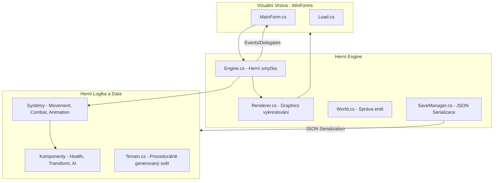

# miniRPG

Tento projekt je pololetní práce na střední škole kybernetiky. Vyvíjeno ve spolupráci se spolužákem.

---

## Návod ke spuštění a ovládání

### Spuštění
1. Otevřete soubor `miniRPG.sln` v aplikaci Visual Studio nebo JetBrains Rider.
2. Ujistěte se, že máte nainstalované SDK pro `.NET 10.0-windows`.
3. Sestavte a spusťte projekt (klávesa `F5` nebo `shift + F10` - zaleží na editoru).

### Ovládání
- **Pohyb:** `W`, `A`, `S`, `D`
- **Interakce (Těžba/Boj/Truhly/Dialog):** `E` (všeobecná klávesa pro akci s nejbližším objektem – skály, stromy, nepřátelé, truhly)
- **Použití předmětu (Hotbar/Inventář):** `F` (použije vybraný předmět z hotbaru nebo označený předmět v otevřeném inventáři)
- **Otevření/Zavření Inventáře:** `I`
- **Obchodování (u Obchodníka):**
  - `N` - Další nabídka (přepínání mezi předměty)
  - `B` - Přepnutí módu (Koupit / Prodat)
- **Hotbar (Výběr slotu):** `NumPad 1` - `NumPad 7` (přepínání aktivního slotu)
- **Systémové:**
  - `F5` - Rychlé uložení (Quick Save)
  * `F6` - Rychlé načtení (Quick Load)
  * `F3` - Debug režim grafiky
- **Testovací/Cheat klávesy:**
  * `R` - Přidání náhodného předmětu
  * `C` - Přidání mince (Coin)

---

## Architektura projektu

Projekt je postaven na principu vlastního **Game Enginu**, kde je herní logika striktně oddělena od vizuální vrstvy (WinForms). Využívá se architektura inspirovaná **ECS (Entity Component System)** a komunikace mezi komponentami probíhá pomocí delegátů a událostí přes centrální `EventBus`.

### Mermaid Diagram Architektury

---

## Tým a rozdělení rolí

| Jméno | Role | Hlavní zodpovědnost |
|-------|------|---------------------|
| **Matěj Dušek** | **Engine & Terrain** | Jádro enginu, rendering, procedurální generování (Perlin Noise), hlavní systémy entit. |
| **František Kopecký** | **UI & Logic Systems** | WinForms UI, Save/Load systém (JSON), inventář, interakce a herní mechaniky. |

---

## Klíčové technologie a implementace
- **Vlastní Algoritmus:** Procedurální generování světa pomocí **Perlin Noise** ve třídě `Terrain.cs`.
- **Game Loop:** Plynulá herní smyčka běžící na stabilních 60 FPS pomocí WinForms Graphics.
- **Save/Load:** Strukturované ukládání stavu světa a hráče do **JSON** souborů s validací poškození dat.
- **Komunikace:** Striktní decoupling pomocí `EventBus` a delegátů.

---

## AI Logbook
Bohužel jsem nezaznamenal moc promptů do AI logbooku a už nestíhám dodat, ale v některých částech kodu je prompt napsaný nahoře, momentálně AI bylo použito hlavně pro poslední změny kvůli nedostatku času. Jako třeba pro útok enemy, dodělání tradera a dodělání generace.
